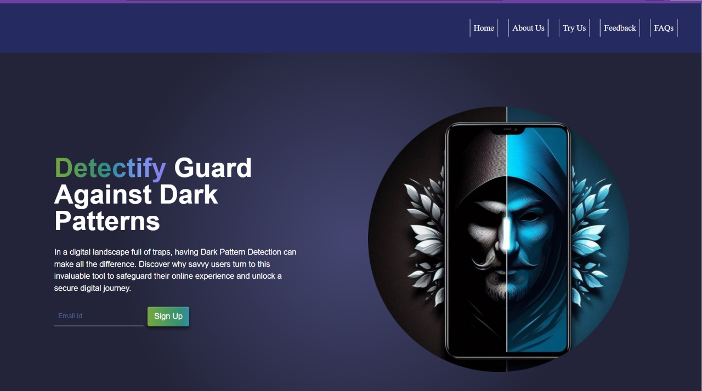
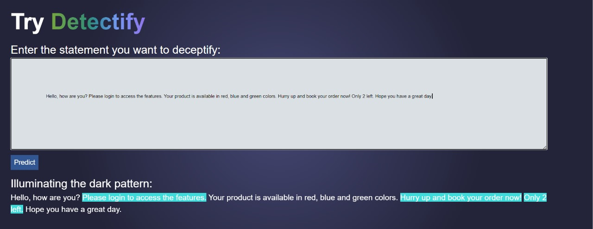

# Detectify 
### Your Guard Against Dark Patterns

Dark Pattern Buster utilizes advanced algorithms to analyze the structure and behavior of websites. 
Users are prompted to enter the website URL they want to examine, and our tool then scans the 
website for known dark patterns. The results are presented in an easy-to-understand report, 
highlighting specific lines of code or design elements that exhibit deceptive patterns.
*Key Features*
*Website Analysis:* Dark Pattern Buster scans websites for various types of dark patterns.
*Line Detection:* The tool identifies specific lines of code or design elements that contribute to 
deceptive practices.
*User-Friendly Interface:* The platform is designed with simplicity in mind, ensuring ease of use for 
all users.
*Educational Resources: * Dark Pattern Buster provides educational content to help users understand 
common dark patterns and make informed decisions online.

 

## How It Works
1. Cutting-edge Detection: Dark Pattern Buster employs an advanced Random Forest model for 
precise identification of deceptive patterns on websites, ensuring a highly accurate analysis.
2. Optimal Balance: The Random Forest model is finely tuned to strike a balance between precision 
and recall, delivering reliable results that capture deceptive elements while minimizing false 
negatives.
3. Instant Results: Our real-time analysis provides users with immediate feedback on deceptive 
design elements, facilitating quick decision-making and enhancing online safety.
4. Adaptable to Trends: Dark Pattern Buster's model adapts to evolving deceptive practices, staying 
current with emerging trends and consistently updating to protect users against the latest dark 
pattern techniques.
5. Line-Level Precision: The model not only identifies deceptive patterns but also offers granular 
insights by pinpointing specific lines of code or design elements contributing to the detected issues.
6. User-friendly Reporting: Results are presented in a clear and actionable report, translating 
complex machine learning outputs into easily understandable insights, empowering users to address 
detected deceptive patterns efficiently.
## Usage
Dark Pattern Buster is a free and open tool for anyone concerned about online manipulation. 
Whether you are a regular user, a privacy advocate, or a web developer, you can contribute to a 
safer online environment by using and promoting Dark Pattern Buster.
